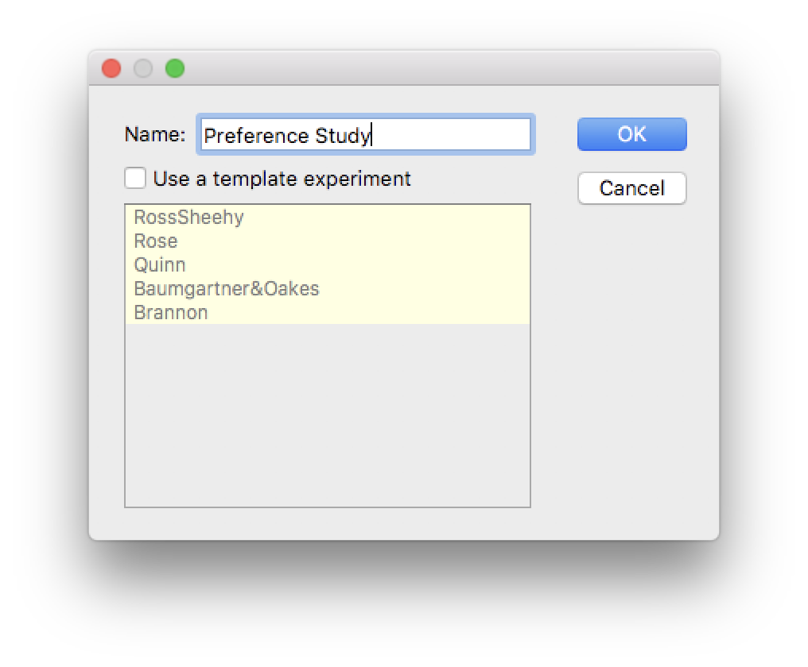

Creating New Experiments
========================

To create a new experiment, click the *New Experiment* button (above) in the main Habit dialog (See Figure 1). Specify a name 
for the experiment and click *OK*. This will create a new, *empty* experiment - i.e. it will have no phases, no stimuli, etc. 
Alternatively, you may specify a *template* experiment, and your new experiment will be a *working duplicate* [1]_ of the template
you chose. Habit2 includes several template experiments, 
each of which demonstrates how to re-create classic experiments in Habit. See our paper (link) for a complete description 
of the templates. 

.. [1] The stimuli for the template experiments are configured assuming that the *default stimulus root* is used for your workspace.
   This restriction is *only* for the template stimuli, and can be changed to suit your preferences.
       

   **Figure 1:** The *New Experiment* dialog. 
   
Cloning existing experiments
----------------------------

Another way to create a new experiment is to *clone*, or *copy*, and existing experiment. Simply click the *Clone*/*Copy* button on 
Habit's main dialog. 

   
Importing experiments
---------------------
An experiment can be imported from a file that was *exported* from Habit. This is a way of moving an experiment from one
workspace to another, or from one *computer* to another. After clicking on the *import* button (below), navigate to the 
export file (it will have an extension of *".hbx"*. 

      
   