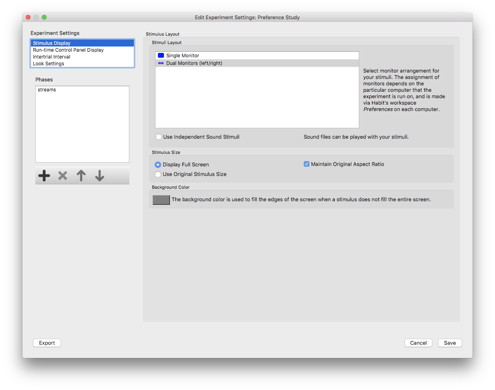

Editing Experiment Settings in Habit
====================================

.. toctree::
   :maxdepth: 3
   
   _stimulusdisplay
   _runtimecontrolpanel
   _intertrialinterval

There are three ways to edit the settings for an experiment:

1. After you create a new experiment, Habit will open the *Experiment Editor* for that experiment.
2. Select the experiment in the *Habit2 Main Dialog* and click the *Edit Experiment* button.
3. Double-click on the experiment name in the *Habit2 Main Dialog*

.. note:: After making any changes in the *Experiment Editor*, you must click *Save* to save your changes. 
   If you click *Cancel*, all your changes will be discarded. You can switch between the settings pages 
   in the *Experiment Editor* without losing changes, as long as you do so before exiting the *Experiment Editor*. 

   
   **Figure 2:** The *Experiment Editor* dialog. Settings pages are selected by clicking on one of the items on the left.
   
There are 4 settings pages that apply to the experiment as a whole:

* `Stimulus Display Settings`_
* The next one
* and the one after that

Each phase of the experiment has its own set of three (tabbed) 
pages that contain the settings specific to each phase:

* Phase Settings
* Trial Settings
* Stimuli

