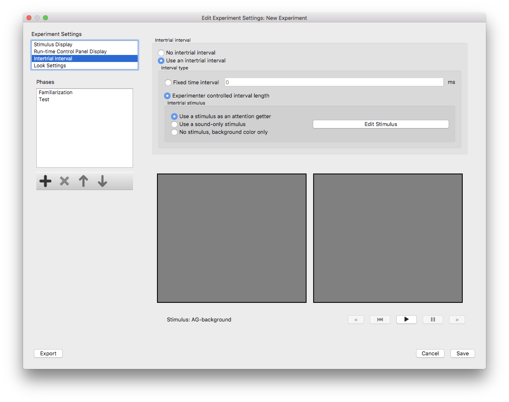

Intertrial Interval
===================

These settings specify what happens *between* trials during an experimental run.

When the *"No intertrial interval”* option is selected, there will be no pause or delay between the stimuli of consecutive trials. 

When the *"Use an intertrial interval"* option is selected, you must specify the *type* of interval, and possibly a stimulus to 
present during the interval. 

An *intertrial interval* can be a fixed time interval, or it can be *experimenter-controlled length. If the interval is a fixed
time, it will last the same amount of time (specify the length in ms), regardless of infant behavior. If the interval is 
*experimenter-controlled*, the interval continues (the specified stimulus is displayed throughout) until the experimenter indicates
that the subject is ready for the next trial (by hitting the <Space> key). 

In either case, Habit can display a stimulus (commonly called an *attention getter*) during the intertrial interval, or can 
display just the background color. There is also an option to play a *sound-only stimulus*. Such a stimulus can be used with a 
*beeping blinking box*, which is a small device with a beeper and an LED light that beeps and flashes in a way that depends on 
the sound level of the stimulus. We provide a schematic for building such a device.

   
   **Figure 1:** The *Intertrial Interval* dialog.

