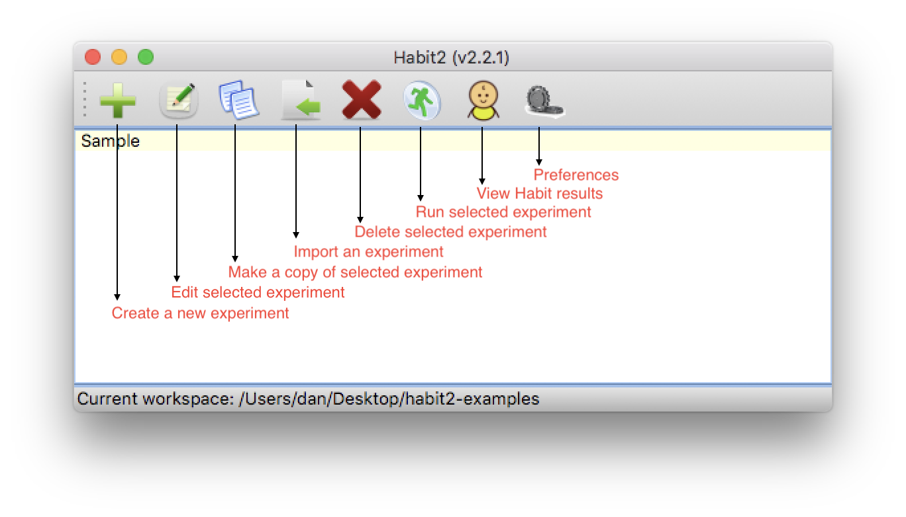
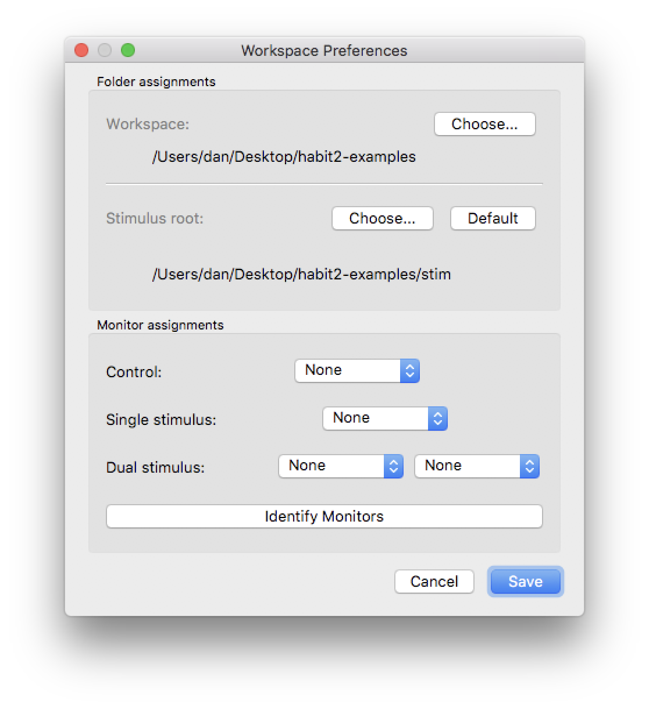

Overview
========

Habit2 has a user-friendly GUI that allows a user to configure a wide variety of infant looking-time experiments, 
save the settings, and share those settings between computers or researchers. 
Habit2 allows for flexible configuration of an unlimited number of experimental phases, 
how individual looks are defined, how trials are times, what kind of stimuli are presented, 
how many stimulus presentation monitors are used, and so on. Once a user has configured settings 
for a particular experiment or procedure, those settings are saved locally and can be exchanged between computers. 
Thus, this information could be stored with other experimental materials in a repository such as the 
`Open Science Foundation <https://osf.io>`_ to support replication efforts. 

In addition, existing experimental settings can be used as a template for developing new procedures. 
Users can make copies of existing experiments and edit those copies to quickly to easily construct variations 
of an experimental configuration. Habit2 comes preloaded with several templates that can be modified to meet 
the needs of a particular study. Some preferences, like assigning stimuli to a specific monitor or defining 
a networked drive path to a shared stimuli folder, can be customized on a per-machine basis to allow labs to 
use Habit2 experiments in different testing rooms with different monitor configurations. 

   
   **Figure 1:** The main Habit2 dialog. Experiments in the current workspace are displayed on a background color 
   which indicates whether their settings are complete (and the experiment can be run).

The Habit2 Workspace
********************
Each time you are running Habit2, either to design and define experiments, or to run those experiments on subjects, 
you are working in what we call a *workspace*. In Habit2, a *workspace* is simply a folder on your system where settings 
and experimental results are stored. You can (but are not required to) also store stimuli within the workspace.

In any *newly-created* workspace folder you will find the following:

*  a database file named *habit22.sqlite*. **This file should not be edited or modified directly.** Habit2 uses this database 
   to save experimental settings. Do not move this file - it must be found in the workspace folder.
*  a folder named *results*. As its name suggests, Habit2 stores the results of each experimental run in this folder. 
*  a folder named *stim*. You can store stimuli here for experiments defined in this workspace 
   (make sure "Use default stimulus root dir" is checked in your Preferences). Newly-created workspaces will have a folder 
   named *examples* linked here, and the stimuli it contains are used in the template experiments. The *examples* folder is shared
   across all workspaces.  
*  a folder named *log*. Habit2 stores log files from each time it is run in this folder. 
   The log files aren't of much use to the user, but may be useful in the event of a crash or other unexpected event in Habit2. 
*  a folder named *misc*. This folder contains sample text files for importing stimuli, and is a read-only folder shared across
   all workspaces. 

(Note - workspace folders created with previous versions of Habit will not have the *examples* folder within the *stim* folder, and
will not have the *misc* folder, either.)

Multiple workspaces may be created on a machine, allowing experimenters to keep groups of related experiments 
together in a single workspace, while allowing for a separation between unrelated groups of experiments. 
An entire workspace folder may be copied between machines, or a networked workspace folder may be shared by 
different users (though the users cannot access the same Habit2 workspace at the same time). 
Users may switch between different workspaces in a Habit2 session using the 

A workspace can be copied to another computer running Habit2 and used there. 
You can design experiments on one machine, then move the workspace to another machine to collect data. 
A lab that runs different classes of experiments can maintain separate workspaces for each type of experiment. 
Experimenters who share a common computer for data collection can easily segregate their settings and stimuli from one another.

**It is important to back up your workspace! Make sure your workspace folder is included in your regular backup schedule.**

The current workspace folder is always displayed in the status bar at the bottom of the main Habit2 dialog. 
In the example below I am using a workspace named *new3*, which I've located on my Desktop. 

Default workspace
-----------------
When Habit2 is first run on a machine, a workspace, called *habit* is automatically created in your Documents folder. 

Creating a new workspace
------------------------
Switching to a different workspace is done via the Preferences settings. 
When you click Select, a chooser dialog opens and you may select an existing workspace folder, 
or you may create a new folder. If a new folder is created and selected, then Habit2 will create a new workspace 
in that folder, and your current Habit2 session will begin using the new workspace immediately.

The Stimulus Root Folder
************************

When Habit runs an experiment it must be able to locate *all* stimulus files. 
The *Stimulus Root Folder* setting can be used to reference stimili file names relative to a common location. When
you specify a stimulus file that is beneath the *stimulus root folder* in your filesystem, Habit will store only the 
portion of the file's path *that is beneath the root folder*. 

What good is that? The *stimulus root* is especially important if you develop
experiments on one computer, but you *run the experiments on a different computer*. The *Stimulus Root Folder* can be set
to a unique values on different computers. You may store your stimuli in a common network share, under a common 
root folder. On each computer from which Habit must access those stimuli files, you can configure the *Stimulus Root Folder*
to be the unique network path to that shared stimulus folder. 

You may simply want to segregate the stimuli for different experiments, so for the experiments in one workspace you
may use one common folder containing stimuli, but for another workspace you use an entirely different set of stimuli. 

Default Stimulus Root Folder
----------------------------

Each workspace has a folder named *stim*, which can be chosen as the stimulus root. If you choose this folder as your 
*stimulus root*, then your entire workspace will be self-contained, and you can move the entire folder structure between
machines, or access the folder from different network locations. When using the workspace, make sure your *Preferences*
have the *default stimulus root* selected.  

Local Preferences
*****************

   
Habit2 also maintains local preferences, which are settings that may vary depending on the specific monitor 
and file system configurations on a given machine. Clicking the *Preferences* icon (above) in Habit's main dialog 
opens the *Workspace Preferences* dialog (see Figure 2).

   **Figure 2:** The *Workspace Preferences* dialog. 

Workspace
   Select the workspace you want to use here. To create a new workspace, click *Choose* and navigate to a new folder. 
   To switch to an existing workspace, navigate to an existing workspace folder. 
   
Stimulus Root
   Navigate to the stimulus root folder, or click the *Default* button to specify that the *stim* folder inside your workspace 
   should be used as the root. **You must click *Save* after changing the stimulus root.** Each workspace on your machine can
   have a different value for the *stimulus root folder*. 
   
Monitor Assignments
   Specify the monitor(s) to use for presenting stimuli. The *control* monitor is the monitor which the experimenter will see during 
   the experiment. The *Identify Monitors* button will display a dialog on each connected screen, showing the correct identifier to 
   use when assigning that monitor to one of the display roles. Note that the stimuli screens are labelled *Center*, *Left*, 
   and *Right* within Habit, and the stimuli files are configured using those same labels, but those names are arbitrary - 
   Habit has no way of knowing the locations of your screens relative to one another. 
   
   When you run an experiment, however, your keypresses that indicate looking indicate that looking is directed
   to a specific monitor (by default, keypress 4, 5, 6 correspond to looking towards the *Left*, *Center*, and *Right* screens, 
   respectively. At the Infant Cognition Lab, we specify the screen orientation as seen by the *experimenter*, not the subject. 
   That's because the experimenter observes the infant from a viewpoint *behind the stimulus screens*. When the infant looks at 
   the screen on their *left*, they are looking to the *right* from the viewpoint of the experimenter. Its
   more natural for the experimenter to indicate that the subject is looking to the *right*, in this case, because they are seeing 
   looking to their right. 
