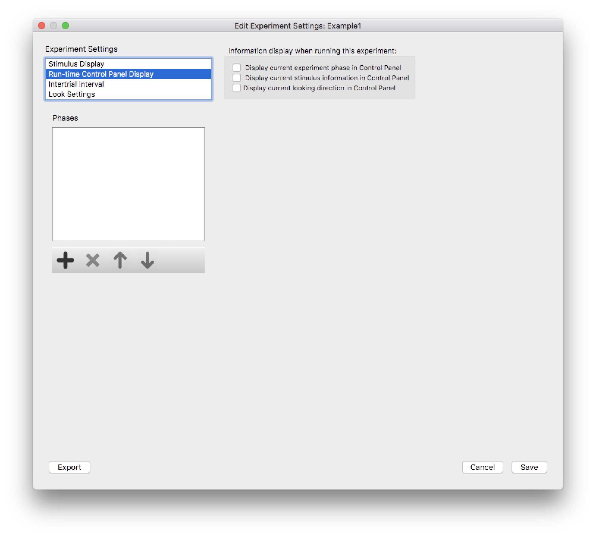
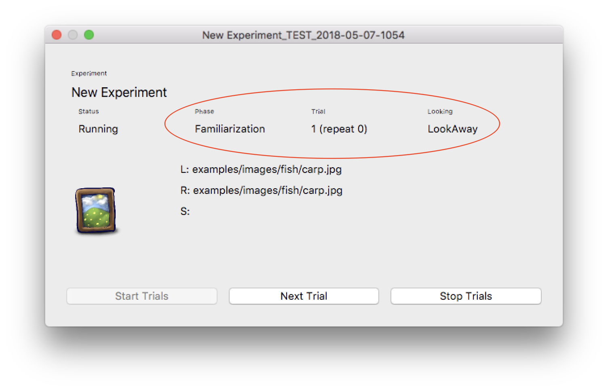
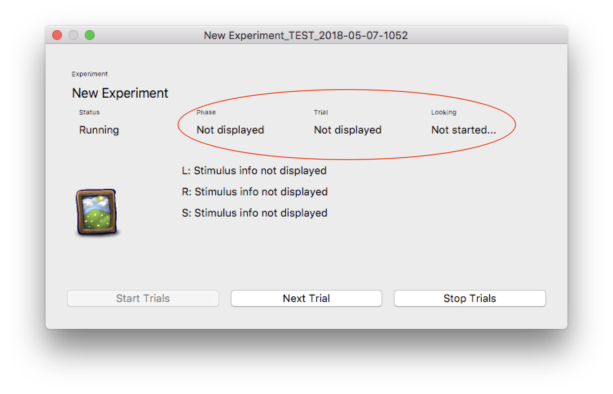

Run-time Control Panel Display Settings
=======================================

The *Run-time Control Panel* is the dialog displayed to the *experimenter* when an experiment is being run. The settings
in this dialog control what information about any particular *phase*, *trial*, or *stimulus* is displayed at run-time
to the experimenter. These settings have no effect on the stimuli displayed to the subject. 

   
   **Figure 1:** The *Experiment Editor* dialog, with *Run-time Control Panel Display* selected.
   
Below are two images of the run-time control panel, each with different *Run-time Control Panel Display Settings*. If you are
concerned about an experimenter being biased by the particular stimulus being displayed, for example, you can un-check all the 
settings. These settings ensure that all experimenters will see the same information for *all experimental subjects*. 

   
   **Figure 2:** The *Habit Run-time Control Panel* dialog. The *Run-time Control Panel Display Settings* for this experiment
   has all boxes *checked*, so all possible information about the phase, trial, and current stimulus are displayed to the 
   experimenter. 

   

   
   **Figure 3:** The *Habit Run-time Control Panel* dialog. The *Run-time Control Panel Display Settings* for this experiment
   has all boxes *un-checked*, so NO information about the phase, trial, and current stimulus are displayed to the 
   experimenter. 
   